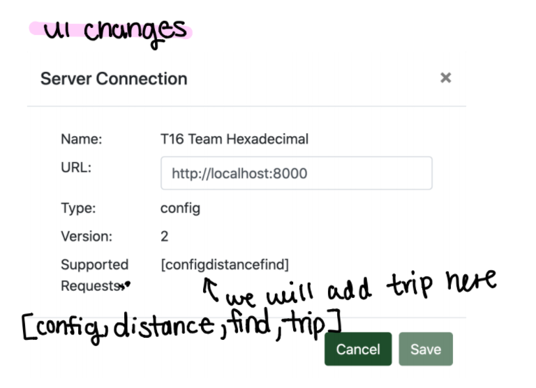

# Introduction

This document describes the architecture and design of a single page web application that interacts with microservices via RESTful APIs.
The key elements in this document include the architecture, user interface, client components, and server classes.

This is a living document that is updated as changes are made each sprint.
The initial document describes the Base code students are given as a starting point for the semester.
Students are expected to update this document as changes are made each sprint to reflect the evolution of their application and key decisions they make.
The Base section serves as an example.

# Base

The Base is a simple application to provide the architecture to the students at the beginning of the semester.
The JavaScript code will be useful examples for students to learn from and leverage in the code they write for sprint 1.
The progressive display of information using collapsible sections and popups will serve as examples of good user interface design.
The overall design is somewhat minimalist/simple for the intended mobile device audience.

### Architecture

The Base architecture is a JavaScript single page web application in an HTML5 browser that uses RESTful APIs to access Micro-services provided by a Java server running on Linux.
The client consists of a minimal index.html file that loads and executes the bundled JavaScript application.
The client and server files are bundled into a single JAR file for execution on the Linux server at a specified port.
The browser fetches the client files from the server on the specified port.

The browser loads the index.html file (by default) which in turn loads the bundled JavaScript single page application bundle.js.
* The single page application makes RESTful API requests to the server on the same port using  JavaScript's asynchronous fetch.  
* A protocol document describes the JSON format for the RESTful API requests and responses.
* JSON Schemas are used to verify requests on the server side and responses on the client side.
* On the client, ReactJS renders the application using ReactStrap, Leaflet, and application defined components.
* GSON is used on the server to convert JSON requests to Java objects and Java objects to JSON responses.
* The client (ulog) and server (SLF4J) logging mechanisms control debugging output during development and production - print statements and console logging should never be used. 

The following architecture elements are not included in the Base system.
They will be added later in the semester.
* Client filesystem .
* Server SQL .
* Server concurrency.

### User Interface

The basic screen in black shows the view on a mobile device, with a header, footer, and map.
The header contains a earth logo and the team name obtained from the server when the client was loaded.
The footer contains a connection icon along with the current server name and server URL the client is connected to.
The blue areas highlight the actions that may be performed.

Rather than buttons or icons to signify actions, we are associating actions with elements that are already on the screen to reduce the clutter.
We are using both popups and collapsible sections in this design rather than choosing to use one exclusively.
* Collapsible/Hidden sections are used for the map and about sections since they have a significant amount of content and we don't need to see them at the same time.
* A popup is used for the URL change since we want to control the interaction until the operation is completed. It seemed more natural than another collapsible section.

#### Clicking on the map places a marker.
Whenever a user clicks on the map, the client should display a marker with latitude and longitude at that location.
We only maintain a single marker at this point displaying the most recently clicked location.

#### Clicking on the team name should tell me more about the team.
Whenever a user clicks the team name in the header, a collapsible section should appear under the header with information about the team.
The collapsible map should disappear so only the about or map are displayed.
A close button / icon in the top right corner of the about will close the about and return the map to display.
A simple toggle in state should be able to control this rendering.
The about page should contain the team name as a heading, but be otherwise blank in base. 

#### Clicking on the URL in the footer should let me change the server.
Whenever a user clicks on the URL a popup should open showing the team name, the URL in an input text box, and a Cancel button.
When the user modifies the URL, a Test button should appear and the server name should disappear.
When the Test button is clicked, it will attempt to connect to the server.
If not successful, nothing changes and the user may continue to make URL changes or click the Cancel button to return to the original sever (it shouldn't change).
If successful, the new server name should appear and a Save button should replace the Test button.
When the user clicks the Save button, the server connection should change and the popup closes, revealing the new servername and URL in the footer.

### Component Hierarchy
The component hierarchy for the base application depicted below shows the our top level App component with four children components.
* App renders the major components on the screen.
* Header renders an icon and a team name in the top banner.
* Footer renders the current server connection in the bottom footer.
* Atlas renders a map.
* About renders information about the team.

We do not show the many ReactStrap components in this hierarchy, even though they will appear when you are debugging on the client.

### Class Diagram
The class diagram for the base application depicted below shows the basic structure of the web server application.

The classes in blue represent the classes specific to this application.  
* WebApplication processes command line parameters and creates MicroServer.
* MicroServer start a web server on the given port, configures the server for security, static files, and APIs for different types of requests, and processes the requests as they arrive.
* JSONValidator verifies a request is properly formatted before attempting to process it using JSON Schemas.
* RequestConfig is a specific request that allows the server to respond with its configuration to allow interoperability between clients and servers. 
* RequestHeader defines the basic components of all requests.

The classes in orange represent the external libraries used by the application.
Often there are several related classes but we've listed only one to simplify the diagram.
* GSON converts a JSON string into a Java object instance.
* Spark provides the necessary web support for our MicroServer.
* JSON provides libraries to manipulate JSON objects using the JSON Schema libraries.
* Logger provides a centralized logging facility used in all of the application classes.

# Sprint 1

### Component Hierarchy

We've made a few new additions as demonstrated in the image above. We created individual files for each member to have their information rendered on the About section of our website. 

### Class Diagram

Not changed.

### UI 

# Sprint 2

### v2 protocol 
**Component Hierarchy** 

**Class Diagram**

**UI**

This is how we are imaging v2 Protocol Epic to look like on our site after Sprint 2.

### Where is?
**Component Hierarchy** 

**Class Diagram**

**UI**

This is how we are imaging Where Is? Epic to look like on our site after Sprint 2. 

### Find places
**Component Hierarchy** 

We has created a Find Distance component which will render Find Distance such as the table and add add markers to the map.

**Class Diagram**

The Find Distance Component is rendered by our Master Tab component which renders all components that are on each tab in our website.

**UI** 

This is how Find Places will look like on the client side.

### Find Distance

**Component Hierarchy** 

**Class Diagram**

**UI**

### Where am I?
**Component Hierarchy** 

No changes to the Component Hierarchy are planned. 

**Class Diagram**

No changes to the Class Diagram are planned.

**UI** 

# Sprint 3

### v3 protocol 
**Component Hierarchy** 

This is an update view that includes all the components that will be required for v3 protocol. Mainly it is concerning the new Trip object. 
 
**Class Diagram**

This is a diagram of how the new classes will be interacting. Mainly it's concerning the new Trip object. The microserver will be sending a request to RequestTrip class and the RequestTrip class will be utilizing the new Trip class to create a new Trip object. Lastly, TestRequestTrip class will be testing our RequestTrip class. 

**UI** 

This is the only change that will occur in the UI. Simply adding Trip as a supported request and displaying it in Server Connection.

### Build a trip 
**Component Hierarchy** 
We moved all our components back to atlas.js because no one on our team could successfully refactor our components as child classes to the parent class atlas.js. 
We were spending too much time trying to do this and we decided (for now) to move everything into atlas.js. In the next sprint we hope to overcome this roadblock. 
Atlas.js is where our Build a Trip component resides. Atlas.js is rendered by App.js.

**Class Diagram**
This is currently how our class diagram looks like on the client side where our build a trip component resides (inside of atlas.js). Our component makes use of restfulAPI, react, and reactleaf-let. 

**UI** 
This is an in-depth picture of our UI and how it looks on our website. The UI components which handle Build A Trip is the "Show Itinerary" button below the map which the user can click on after they have added their locations on the map. This will show them the list of places they have added as well the distances of those places + the round trip total. 
For the user to build a trip they can do it via three methods on our site: map click, text input of long/lat or by searching places. 

### Find places
**Component Hierarchy** 
The component hierarchy for "Find places" depicted below shows our top-level App component and the component that relatively to "Find Places".
* App renders the major components on the screen
* Atlas renders a map and all markers information
* Find Place contains all the information which needed to find a place and set markers

We only show the components related to "Find Places", which could help to understand the hierarchy quickly.

**Class Diagram**
This is currently how our class diagram looks like on the client side where our find places component resides (inside of atlas.js). Our component makes use of restfulAPI, react, and reactleaf-let.

**UI** 

The basic screen in black shows the view on the computer. Users can type their searching string to the searching box. After press "Enter", the data related to the searching string will pop up and showed in the table. We also have "add" buttons for users to add markers to locate the place where they search.
# Sprint 4 
# Sprint 5
